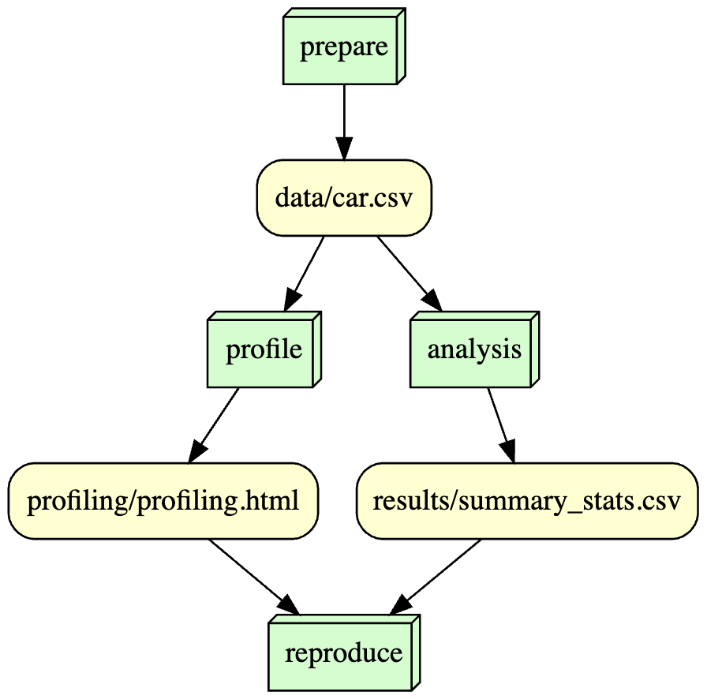

## Overview 

that describes your project (~200 words). This should include a
description of the selected dataset (from step 1) and your analysis/visualization
(from step 7).

The Car Evaluation dataset is from the UC Irvine Machine Learning Repository and was uploaded on May 31, 1997. It includes information about a car's buying price, it's price of maintenance, the number of doors, the number of people it seats, the size of the trunk(also called luggage boot), the estimated safety of the car, and the evaluation level of the car(unacceptable, acceptable, good, very good) and the variables are called buying, maint, doors, persons, lug_boot, safety,  class, respectively. There are 6 variables and they are akk categorical and the target variable is class while the other variables are features.

The analysis that I decided to do with this dataset is identifying the range of car prices customers buy their cars for and after doing the analysis that resulted in a bar graph - it was shown that the frequency of buying prices was the same across all 4 categories which were vhigh, high, med, low.

## Analysis 

Like mentioned before I wanted to identify the range of car prices customers buy their cars for. I generated a frequency bar graph named buying.png and found that the four categories had very similiar shapes with each category (vhigh, high, med, low) having more than 400 counts (y-axis). This indicates that the data has a balanced distribution. 

## Workflow 

 

## Reproducing 

Information about the environment: 
   - macOS Version: 13.2.1
   - Python Version: 3.9.12
   - BuildVersion: 22D68

Installing the Dependencies:
   Install the following required Python packages found in the requirements.txt:
   pip install -r requirements.txt

Running The Script:

Execute the scripts in order:

     python scripts/prepare_data.py

     python scripts/profiling.py

     python scripts/analysis.py
     
     python scripts/dag.py

Going through with these steps will help you set up the necessary environment, run the script successfuly resulting in the proper outputs.

## License
Software License: MIT License 
- open source and freely available allowing free use of data as long as credit is given to the original contributer.
Data License: Creative Commons Attribution 4.0 License (CC-BY-4.0) 
-  permits redistribution which is the sharing and use of data/content while giving appropriate credit.

## References 

Bohanec, M. (1997). Car Evaluation. UCI Machine Learning Repository. https://doi.org/10.24432/C5JP48.